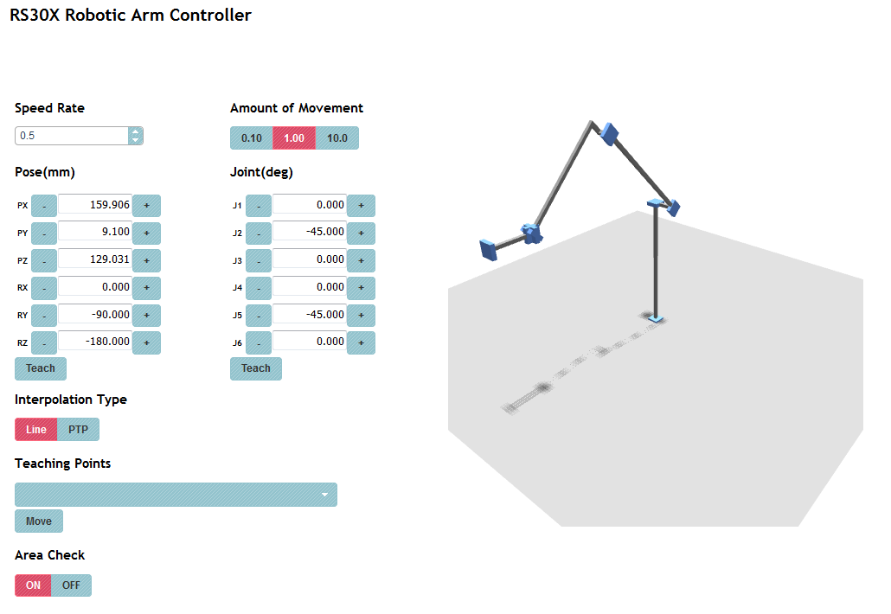

RS30X-robot-arm-controller.py
=============================

RS30X-robot-arm-controller.py is a 6 axis robotic arm controller via FUTABA RS30X command type servo.

### Overview

 * PUMA 360 robot model
 * web UI

    


### Getting Started
 
 * Get [RS30X.py](https://github.com/mnishi/RS30X.py)

    ```sh
    $ git submodule init
    $ git submodule update
    ```

 * Install other libraries

    ```sh
    pip install -r requirements.txt
    ```

 * Start controller

    ```sh
    $ python controller.py
    ```

 * Access http://your_host_address:8000
